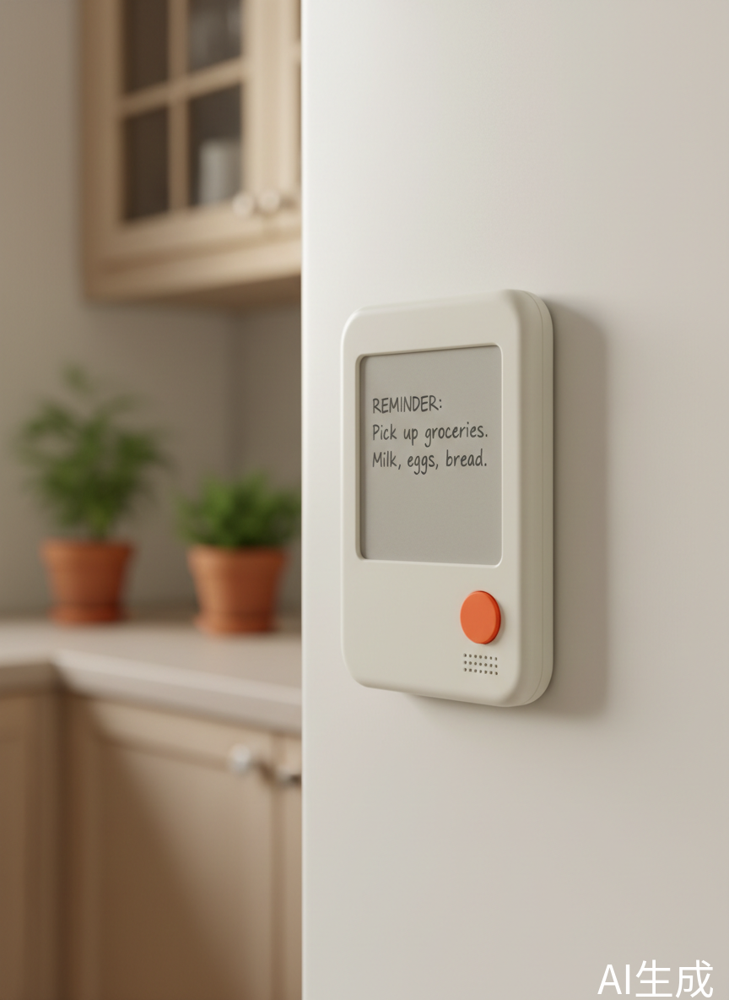

# AI便利贴

便携式电子墨水屏显示设备，支持语音交互。

## 功能

- **日期显示** - 大号日期，支持农历
- **天气** - 当前温度、天气状况
- **待办事项** - 语音添加待办清单
- **日程** - 日历视图
- **倒计时** - 重要日子倒数
- **语音交互** - 长按说话设置提醒、切换页面

## 硬件特性

- 电子墨水屏，常显不耗电
- **单按钮操作**，不支持触摸（单击/双击/长按）
- 磁吸设计，可贴冰箱
- 自带支架，可立桌面
- 续航 2-4 周

## 使用方式

**按钮操作**
- **单击** - 切换到下一页
- **双击** - 切换到上一页
- **长按** - 进入语音输入模式

**语音指令**
- "提醒我下午3点开会"
- "添加待办提交报告"
- "切换到天气"

## 适用场景

- 冰箱门 - 查看待办、天气
- 工位 - 待办清单、日程提醒
- 书桌 - 考试倒计时
- 床头 - 查看次日安排
